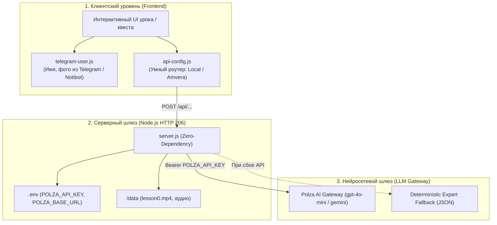

# 🤖 ИИ для Mini Apps: Polza AI, Notibot, Amvera & Zero-Crash Архитектура

Специализация: **Быстрое, бесшовное и отказоустойчивое подключение искусственного интеллекта (LLM) к интерактивным мобильным веб-интерфейсам, Telegram Mini Apps и Notibot-воронкам.**

---

## 🎯 1. Ключевой Принцип: «Zero-Crash & Zero-Stub»

1. **Никаких белых экранов**: Никакая сетевая ошибка, отсутствие ключа API или таймаут не должны останавливать воронку пользователя. Всегда активен структурированный оффлайн-фоллбэк по методологии автора.
2. **Никаких временных заглушек**: Использовать только реальные системные промпты, валидный JSON и реальные данные пользователей Telegram.
3. **Автоматический роутинг**:
   - Локально $\rightarrow$ `http://localhost:3000`
   - В Telegram / Notibot $\rightarrow$ `https://inter01-anatolyfedorov.amvera.io`
   - В автономном режиме $\rightarrow$ Встроенный эвристический анализатор.

---

## 🏗 2. Трёхуровневая Архитектура



---

## 📦 3. Готовые Модули Интеграции

### 1️⃣ Фронтенд: Умный коннектор `api-config.js`
Подключается в `<head>` страницы:
```html
<script src="api-config.js"></script>
```
Использование в коде:
```javascript
const result = await window.apiPost('/api/lesson1-strategy', {
  fact: "Партнёр молчит 2 часа",
  feeling: "Тревога и накручивание",
  action: "Пишу 'Ты где пропал?'",
  relief: "Иллюзия контроля",
  result: "Холодность и отстранение",
  userName: window.currentUserName || "Участник"
});
```

### 2️⃣ Фронтенд: Авто-персонализация `telegram-user.js`
Автоматически считывает `Telegram.WebApp.initDataUnsafe.user` и Notibot postMessage:
```html
<script src="telegram-user.js"></script>
```
Обновляет шапку:
```html
<div class="identity">
  <div id="userAvatar" class="avatar">?</div>
  <div id="userGreeting" class="greeting">Привет!</div>
</div>
```

### 3️⃣ Бэкенд: Роутер `server.js` с Polza AI шлюзом
Принимает запросы клиента и обращается к Polza AI Gateway:
- **URL**: `https://api.polza.ai/v1/chat/completions` (или `https://polza.ai/api/v1/chat/completions`)
- **Headers**: `Authorization: Bearer ${POLZA_API_KEY}`, `Content-Type: application/json`
- **Body**:
```json
{
  "model": "gpt-4o-mini",
  "messages": [
    { "role": "system", "content": "Твой системный промпт..." },
    { "role": "user", "content": "Ответы пользователя..." }
  ],
  "response_format": { "type": "json_object" },
  "temperature": 0.7
}
```

---

## ⚡️ 4. Чек-Лист Подключения ИИ к Новому Экрану за 1 минуту

- [ ] **Шаг 1**: Подключить `<script src="api-config.js"></script>` и `<script src="telegram-user.js"></script>`.
- [ ] **Шаг 2**: Добавить форму сбора ответов с `id="inpFact"`, `id="inpFeeling"` и т.д.
- [ ] **Шаг 3**: Вызвать `window.apiPost('/api/endpoint', payload)` по клику на кнопку.
- [ ] **Шаг 4**: Обеспечить отображение результата через `showAiResult(data)` и виброотклик `safeHaptic('success')`.
- [ ] **Шаг 5**: Проверить оффлайн-фоллбэк: если отключить сеть, экран должен мгновенно выдать заготовленный экспертный анализ.

---

## 🛠 5. Переменные Окружения (`.env`)

```ini
# Polza AI Gateway
POLZA_BASE_URL=https://api.polza.ai/v1
POLZA_API_KEY=your_polza_api_key_here
POLZA_MODEL=gpt-4o-mini

# Server Port
PORT=3000
```
